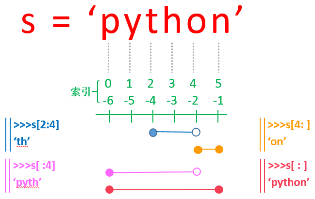
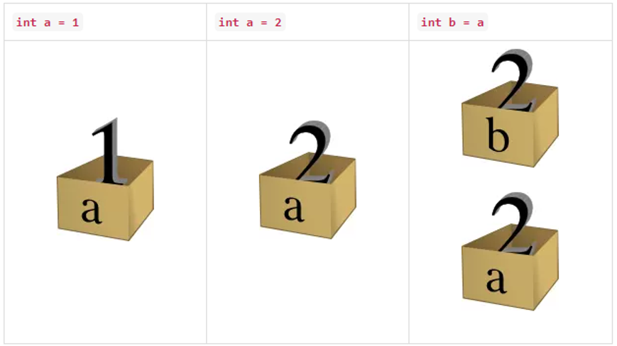
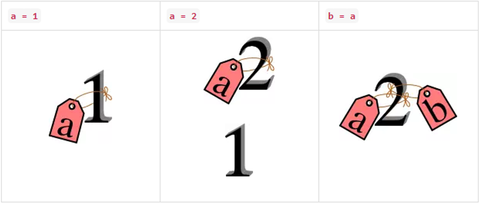

# 第二章 Python编程基础

作者：李昕

单位：中国石油大学（华东）

## 1. Python基础语法

### Python中变量的命名规则：

- 变量名只能是字母、数字或下划线的任意组合
- 变量名的第一个字符不能是数字
- 变量名对大小写敏感

用变量保存的数据可以有多种类型。例如，一个人的年龄可以用数字存储，他的名字可以用字符串存储。Python 定义了一些标准类型，用于存储各种类型的数据。

### Python保留字

保留字即关键字，我们不能把它们用作任何标识符名称。Python 的标准库提供了一个 keyword 模块，可以输出当前版本的所有关键字：

~~~ python
import keyword
keyword.kwlist
""" =>
['False', 'None', 'True', 'and', 'as', 'assert', 'break', 'class', 'continue', 'def', 'del', 'elif', 'else', 'except', 'finally', 'for', 'from', 'global', 'if', 'import', 'in', 'is', 'lambda', 'nonlocal', 'not', 'or', 'pass', 'raise', 'return', 'try', 'while', 'with', 'yield']
"""
~~~

### 注释

Python中单行注释以 # 开头，多行注释可以用多个 # 号，或 ''' 和 """：

~~~ python
# 第一个注释
print("Hello, Python!") # 第二个注释

'''
第三注释
第四注释
'''
 
"""
第五注释
第六注释
"""
print("Hello, Python!")	# => Hello, Python!
~~~

> 在本教材中，将=>放在注释的开始部分，表示注释内容是对应代码的输出结果

### 赋值

 Python允许你同时为多个变量赋值 ， 也可以为多个对象指定多个变量。 

~~~python
a = b = c = 1
~~~
创建一个整型对象，值为 1，从后向前赋值，三个变量被赋予相同的数值。
~~~python
a, b, c = 1, 2, "upc"
~~~

 两个整型对象 1 和 2 的分配给变量 a 和 b，字符串对象 "upc" 分配给变量 c。 

## 2. Python基本数据类型：

### 2.1 Numbers（数字）

Python3 支持 **int、float、bool（布尔）、complex（复数）** 4种数字类型。布尔类型只有*True*和*False*两个值。在Python中比较特殊的一点是，没有数值范围的限制，因此支持大数计算。

~~~python
a, b, c, d = 20, 5.5, True, 4+3j
print(type(a), type(b), type(c), type(d))	#type()函数用于获取变量的类型
# => <class 'int'> <class 'float'> <class 'bool'> <class 'complex'>
  
#Python支持“大数”计算
342534253432453425+3453452323423   # => 342537706884776848
~~~

  Python中的数值运算基本与其他程序语言相同，增加了整除(//)和乘方(**)两种运算。

  ~~~python
5 + 4   # => 9
4.3 - 2 # => 2.3
3 * 7   # => 21
2 / 4   # => 0.5 除法，得到一个浮点数
2 // 4  # => 0   整数除法，得到一个整数
17 % 3  # => 2   取余 
2 ** 5  # => 32	 乘方
  ~~~

### 2.2 String（字符串）

字符串的创建和基本运算


~~~python
# 可以通过 " 或者 '来创建字符串，两种方法创建的字符串等效
"This is a string."
'This is also a string.'
   
# 字符串间可以通过 + 号进行连接
"Hello " + "world!"   # => "Hello world!"

#可以通过 * 号，对字符串进行复制，比如：
"Hello" * 3          # => "HelloHelloHello"
~~~

   Python的字符串有两种索引方式，第一是从左往右，从0开始依次增加，第二种是从右往左，从-1开始依次减少。

   > 注意！没有单独的字符类型，一个字符就是长度为1的字符串。


   ~~~python
word = 'Python'
print(word[0], word[5])   # => P n
print(word[-1], word[-6])   # => n P
   ~~~

可以对字符串进行切片，获取一段子串，具体用法如图2-10所示，用冒号分隔两个索引，

**变量[头下标:尾下标]**

截取的范围是左闭右开，并且两个索引都可以省略。

   > 字符串的切片是原字符串的副本，对切片的修改不影响原字符串

   
   图2-10 字符串切片用法


   ```python
s = 'ILovePython'
s[1:5]    # => 'Love'
#隔2个跳着取,用冒号分隔的第3个参数表示步长，通常省略
s[1:10:2]    # => 'LvPto'
s[:]    # => 'ILovePython'
s[5:]    # => 'Python'
s[-10:-6]    # => 'Love'
   ```

   采用函数len()获取字符串的长度

>  注意：len()方法同样可以用于其他数据类型，例如查看列表、元组以及字典中元素的多少。


   ```python
name = "Hello, Python"
print(len(name))     # => 13
   ```

### 2.3 List（列表）

List（列表） 是 Python 中使用最频繁的数据类型。列表可以完成大多数集合类的数据结构实现。列表中元素的类型可以不相同，它支持数字，字符串甚至可以包含列表（所谓嵌套）。列表是写在方括号 **[]** 之间、用逗号分隔开的元素列表。

和字符串一样，列表同样可以被索引和截取，列表被截取后返回一个包含所需元素的新列表（副本），使用语法形式与字符串完全相同。

```python
list = [ 'abcd', 786 , 2.23, 'upc', 70.2 ]
tinylist = [123, 'upc']
 
print(list)            # => ['abcd', 786, 2.23, 'upc', 70.2] 输出完整列表
print(list[0])         # => abcd 输出列表第一个元素
print(list[1:3])       # => [786, 2.23] 从第二个开始输出到第三个元素
print(list[2:])        # => [2.23, 'upc', 70.2] 输出从第三个元素开始的所有元素
print(tinylist * 2)    # => [123, 'upc', 123, 'runoob'] 输出两次列表
print(list + tinylist) # => ['abcd', 786, 2.23, 'upc', 70.2, 123, 'upc'] 连接列表
```

 与Python字符串不一样的是，列表中的元素是可以改变的： 

```python
a = [1, 2, 3, 4, 5, 6]
a[0] = 9 
a[2:5] = [13, 14, 15]  
print(a) # => [9, 2, 13, 14, 15, 6]
a[2:5] = []   # 将对应的元素值设置为 [] 
print(a)	# => [9, 2, 6]
```

通过split()函数将字符串进行分隔，然后可以用个join()函数将字符串进行拼接。

```python
input = 'I like upc'
# 通过空格将字符串分隔符，把各个单词分隔为列表，split的参数表示分隔的字符
inputWords = input.split(" ") 
print(inputWords)	# => ['I', 'like', 'upc']
# inputWords[::-1] 有三个参数
# 前两个参数为空，表示取列表中的所有元素
# 第三个参数为步长，-1 表示逆向
inputWords=inputWords[::-1] 
print(inputWords)	# => ['upc', 'like', 'I']
# 重新组合字符串，在几个字符串之间用空格进行连接
output = ' '.join(inputWords) 	#join函数只能将多个字符串进行连接
print(output)	# => upc like I
```

> split(str="", num=string.count(str))函数原型中有两个参数，str表示分隔符，num表示  分割次数。默认为 -1, 即分隔所有。 


### 2.4 Tuple（元组）

元组（tuple）与列表类似，不同之处在于元组的元素不能修改。元组写在小括号 **()** 里，元素之间用逗号隔开。元组中的元素类型也可以不相同， 可以把字符串看作一种特殊的元组。 

虽然tuple的元素不可改变，但它可以包含可变的对象，比如list列表。

构造包含 0 个或 1 个元素的元组比较特殊，所以有一些额外的语法规则：

```python
tup0 = ()    # 空元组
tup1 = (20,) # 一个元素，需要在元素后添加逗号
```

在Python中很多地方使用隐式元组，它使Python更具有灵活性。例如

```python
a, b, c = 1, 2, "upc"
#可以理解为
(a, b, c) = (1, 2, "upc")
#即两个元组的对应元素逐个赋值
```

> 在C语言中，很多地方都规定必须唯一，比如：赋值号的左侧只能有一个变量，函数的返回值只能有一个值，Python借助隐式元组完美的解决了这些问题。

利用隐式元组，可以非常简单的实现两个变量的值交换。

```python
a,b=3,5		#多变量赋值
a,b=b,a		#交换a和b的值
print(a,b)	# => 5 3
```

### 2.5 Set（集合）

集合（set）是由一个或数个形态各异的大小整体组成的，构成集合的事物或对象称作元素或是成员。基本功能是进行成员关系测试和删除重复元素。可以使用大括号 **{ }** 或者 **set()** 函数创建集合，注意：创建一个空集合必须用 **set()** 而不是 **{ }**，因为 **{ }** 是用来创建一个空字典。

```python
student = {'Tom', 'Jim', 'Mary', 'Tom', 'Jack', 'Rose'}
# 输出集合，重复的元素被自动去掉 
print(student)   # => {'Mary', 'Jim', 'Rose', 'Jack', 'Tom'}

# 成员测试
if 'Rose' in student :
    print('Rose 在集合中')   # => Rose 在集合中
else :
    print('Rose 不在集合中')    
 
# set可以进行集合运算
a = set('abracadabra')
b = set('alacazam')
 
print(a)   # => {'b', 'a', 'c', 'r', 'd'}
# a 和 b 的差集
print(a - b)   # =>  {'b', 'd', 'r'}  
# a 和 b 的并集 
print(a | b)   # =>  {'l', 'r', 'a', 'c', 'z', 'm', 'b', 'd'}    
# a 和 b 的交集 
print(a & b)   # =>  {'a', 'c'}    
# a 和 b 中不同时存在的元素 
print(a ^ b)   # =>  {'l', 'r', 'z', 'm', 'b', 'd'}    
```

集合中的元素是无序的，注意以上例子中，输入的集合和输出的集合顺序是不一致的。

> 集合(set)常用来抽取一系列元素中的唯一值。但因为集合是无序的，不能保证元素顺序的不变性。

### 2.6 Dictionary（字典）

字典（dictionary）是Python中另一个非常有用的内置数据类型。列表是有序的对象集合，字典是无序的对象集合。两者之间的区别在于：字典当中的元素是通过键来存取的，而不是通过偏移存取。字典是一种映射类型，字典用 **{ }** 标识，它是一个无序的 **键(key) : 值(value)** 的集合。键(key)必须使用不可变类型，而且在同一个字典中，键(key)必须是唯一的。

```python
aDict = {}
aDict['one'] = "中国石油大学"
aDict[2]     = "智能科学系"
tinydict = {'name': 'upc','code':1, 'site': 'www.upc.edu.cn'}	#典型的键和值组成的集合
 
 
print (aDict['one'])      # => 中国石油大学        输出键为 'one' 的值
print (aDict[2])          # => 智能科学系          输出键为 2 的值
print (tinydict)          # => {'name': 'upc', 'code': 1, 'site': 'www.upc.edu.cn'}
print (tinydict.keys())   # => dict_keys(['name', 'code', 'site'])  
print (list(tinydict.keys()))	# => ['name', 'code', 'site']     将键值集合转换为列表
print (tinydict.values()) # => dict_values(['upc', 1, 'www.upc.edu.cn']) 
print (list(tinydict.values()))	# => ['upc', 1, 'www.upc.edu.cn']      将值集合转换为列表
```

> 字典的键就是一个集合(set)

## 3. Python变量的内存模型

在赋值过程中，C语言是以变量为中心的，当执行语句*int a=1;*时，根据数据类型int为a分配空间，然后将值1赋值到该空间中；当赋予新值时，空间位置不变，用新值将原来的值进行覆盖；当执行语句*int b=a;*时，为b分配新空间，并将a的值复制过去，如图1.1所示。



Python中对变量没有显式的定义，但是在使用一个变量前，必须先对其进行赋值，通过赋值完成变量的定义。Python对变量的空间分配形式与C语言等其他语言是不同的，Python以值为中心，如图1.2所示。 在Python中对变量名的访问（例如a=1），可以理解为通过只读的指针（地址）访问存放数据的内存空间，通过变量中存放的地址访问内存。只能读，不能写，写的话（例如将a的值改为2）将导致重新分配一块内存空间，存放新数据，并将变量中存放的原有的地址替换成新地址。将一个变量赋值给另一个变量时（例如b=a），实际上是两个变量名指向了同一个内存空间。

> Python中对一个变量重新赋值，将导致该变量指向新的内存空间
>
> 在基本数据类型中，字符串和元组与数字类型相同，都属于不可更改类型



~~~python
#id() 函数用于获取对象的内存地址
a=1
print(id(a))	# => 140713032544000
a=2
print(id(a))	# => 140713032544032
b=a
print(id(b))	# => 140713032544032
c=1
print(id(c))	# => 140713032544000
d=2
print(id(d))	# => 140713032544000
~~~

在以上的代码示例中可以获知a被重写赋值后，内存空间发生了变化；(2) 用a对b进行赋值后，b和a的内存空间相同。(3) Python中是以值为中心的，变量c和原始的a、变量d和变量b原本没有任何关系，但是因为存储的值相同，导致对应变量的空间位置是相同的。

## 3. 类型转换

Python中采用函数进行类型转换

| 函数                                                         | 描述                                                |
| :----------------------------------------------------------- | :-------------------------------------------------- |
| int(x\[,base\])                                              | 将x转换为一个整数                                   |
| [float(x)](https://www.runoob.com/python3/python-func-float.html) | 将x转换到一个浮点数                                 |
| [str(x)](https://www.runoob.com/python3/python-func-str.html) | 将对象 x 转换为字符串                               |
| [eval(str)](https://www.runoob.com/python3/python-func-eval.html) | 用来计算在字符串中的有效Python表达式,并返回一个对象 |
| [tuple(s)](https://www.runoob.com/python3/python3-func-tuple.html) | 将序列 s 转换为一个元组                             |
| [list(s)](https://www.runoob.com/python3/python3-att-list-list.html) | 将序列 s 转换为一个列表                             |
| [set(s)](https://www.runoob.com/python3/python-func-set.html) | 转换为可变集合                                      |
| [dict(d)](https://www.runoob.com/python3/python-func-dict.html) | 创建一个字典。d 必须是一个 (key, value)元组序列。   |
| [frozenset(s)](https://www.runoob.com/python3/python-func-frozenset.html) | 转换为不可变集合                                    |
| [chr(x)](https://www.runoob.com/python3/python-func-chr.html) | 将ASCII码值转换为一个字符                           |
| [ord(x)](https://www.runoob.com/python3/python-func-ord.html) | 将一个字符转换为它的ASCII码值                       |
| [hex(x)](https://www.runoob.com/python3/python-func-hex.html) | 将一个整数转换为一个十六进制字符串                  |
| [oct(x)](https://www.runoob.com/python3/python-func-oct.html) | 将一个整数转换为一个八进制字符串                    |

### 4. 数据的输入和输出

### 输入

*input([prompt])*函数用来从标准输入读取一行文本。*prompt*表示输入提示，可省略。*input()*函数将一个回车之前的内容全部读入，返回值是文本类型。

```python
s = input("Please input: ");		# => Please input：中国石油大学
print ("The content is: ", s)		# => The content is: 中国石油大学
```

当输入内容是一个非字符串类型时，需要进行强制类型转换

```python
num = int(input())   #if the input is 56 and you wanna get an integer
print(num)		# => 56
print(type(num))	# => <class 'int'>
```

当输入是多个相同类型的变量时，可以采用*map()*函数进行批量转换。*map(function, iterable, ...)*函数的第一个参数 *function* 以参数序列中的每一个元素调用 *function* 函数，返回包含每次 *function* 函数返回值的新列表。 
```python
s = input()   #if the input is '3.4, 5.6, 8.7' and you wanna get 3 float number
numLst = s.split(',')		# split 's' to a list with seperator ','
#make a list of return values of function 'float' for each element in 'numLst'
resultLst = map(float,numLst)    
a,b,c = resultLst   #set a,b,c with 3 elements in list 'resultLst'
print(a,b,c)  # => 3.4 5.6 8.7
print(type(a),type(b),type(c))	# => <class 'float'> <class 'float'> <class 'float'>
```

变量*s* 把'3.4, 5.6, 8.7'作为一个字符串接收，通过split函数，以逗号为分隔符，形成了一个列表*numLst*，然后其中的每一个元素受函数float的作用，将返回值形成了一个新列表resultLst，resultLst中的每一个元素都是float类型，最后将列表中的三个元素对应赋值给变量*a,b,c*。可以将以上代码简化为一条语句：
```python
a,b,c = map(float,input().split(','))   #if the input is “3.4, 5.6, 8.7” 
print(a,b,c)  # => 3.4 5.6 8.7
```

### 输出

print函数可以添加参数sep和end，sep表示输出多个对象时的分隔符号，默认为空格，end表示结束符号，默认为回车。

```python
print(1,2,3)    # => 1 2 3
print(1,2,3,sep=',')	# => 1,2,3 逗号作为分隔符
#左对齐，居中对齐，右对齐
print(str(1).ljust(3),'|',str(2).center(3),'|',str(3).rjust(3),'|',sep='')#=>1  | 2 |  3|
print(str(12).zfill(5))		# => 00012     左侧补0
```

Python用 str.format()  函数进行输出的格式化

```python
#大括号及其里面的字符 (称作格式化字段) 将会被 format() 中的参数替换。
print('{}网址： {}'.format('中国石油大学', 'www.upc.edu.cn'))
# => 中国石油大学网址： www.upc.edu.cn

#在大括号中的数字用于指向传入对象在 format() 中的位置
print('{0} {1}'.format('intelligence', 'technology'))
# => intelligence technology
print('{1} {0}'.format('intelligence', 'technology'))
# => technology intelligence

#如果在 format() 中使用了关键字参数, 那么它们的值会指向使用该名字的参数
print('{name}网址： {site}'.format(name='中国石油大学', site='www.upc.edu.cn'))
# => 中国石油大学网址： www.upc.edu.cn

#位置及关键字参数可以任意的结合
print('{0} {1} {dept}'.format('intelligence', 'technology', dept='department'))
# => intelligence technology department
```


## 练习题

1. 身份证的第17位代表性别，奇数为男，偶数为女，输入一个身份证号，判断拥有人的性别。
2. 身份证的7-14位代表出生日期，输入一个身份证号，按照“xxxx年xx月xx日”的格式，输出拥有人的出生日期。
3. 判断一个输入的数据是否是对称数
4. 输入n个整数，去除其中的重复数据
5. 用一条语句，将一个有n个整数组成的列表中的数据全部输出，不能输出中括号。
6. 如何将一个字符串的第一个字母修改为‘a'

## 参考文献

1. Runoob的Python3教程， https://www.runoob.com/python3 
2. 廖雪峰Python3教程， https://www.liaoxuefeng.com/wiki/1016959663602400 