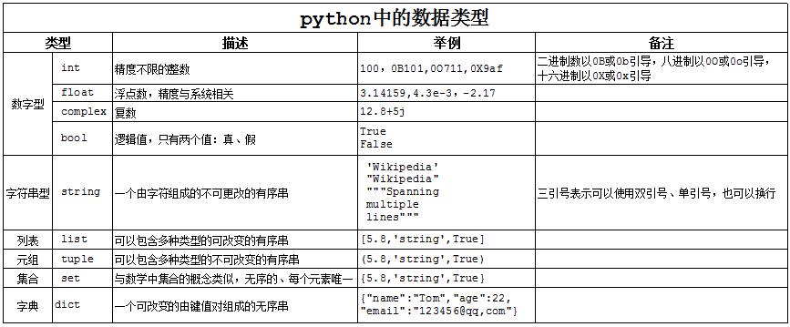

# 第二章 python编程基础

作者：李昕

单位：中国石油大学（华东）

## 1. 基本的数据类型

在程序中，有时我们需要对两个数据进行求和，那么该怎样做呢？

大家类比一下现实生活中，比如去超市买东西，往往咱们需要一个菜篮子，用来进行存储物品，等到所有的物品都购买完成后，在收银台进行结账即可。如果在程序中，需要把2个数据，或者多个数据进行求和的话，那么就需要把这些数据先存储起来，然后把它们累加起来即可。在python中，表示一个数据，需要一个变量。

python中变量的命名规则：

- 变量名只能是字母、数字或下划线的任意组合
- 变量名的第一个字符不能是数字
- 中间不能出现空格
- 长度没有限制
- 变量名对大小写敏感
- 以下关键字不能声明为变量名

'and', 'as', 'assert', 'break', 'class', 'continue', 'def', 'del', 'elif', 'else', 'except', 'exec', 'finally', 'for', 'from', 'global', 'if', 'import', 'in', 'is', 'lambda', 'not', 'or', 'pass', 'print', 'raise', 'return', 'try', 'while', 'with', 'yield'

> 温馨提示：最重要的是前两条规则

用变量保存的数据可以有多种类型。例如，一个人的年龄可以用数字来存储，他的名字可以用字符来存储。python 定义了一些标准类型，用于存储各种类型的数据。

python有六个标准的数据类型：

- Numbers（数字）
- String（字符串）
- List（列表）
- Tuple（元组）
- Set（集合）
- Dictionary（字典）


## 2. 常量与变量

在所选择的程序设计语言中，各种数据类型常量的书写规则、变量的定义与命名规则、变量的存储与复制，以及数据类型的转换规则

## 3. 运算符与表达式

算术、赋值、关系、逻辑等运算符的操作含义和优先级、结合性的概念，常用表达式的概念、书写方式和计算规则，重点强调大数计算

## 4. 数据的输入和输出

在所选择的程序设计语言中，不同数据类型数据的输入；在所选择的程序设计语言中，不同数据类型数据的输出，map函数的使用

## 5. 字符串

了解字符串的定义方法，索引的使用，切片的建立方法

1）字符串的创建和基本运算


```python
# 可以通过 " 或者 '来创建字符串
"This is a string."
'This is also a string.'

# 字符串间可以通过 + 号进行连接
"Hello " + "world!"   # => "Hello world!"
# 甚至不使用'+'号，也可以把字符串进行连接
"Hello " "world!"     # => "Hello world!"

#可以通过 * 号，对字符串进行复制，比如：
"Hello" * 3          # => "HelloHelloHello"
```


    'HelloHelloHello'


2）索引
python中的字符串有两种索引方式，第一是从左往右，从0开始依次增加，第二种是从右往左，从-1开始依次减少。
注意！没有单独的字符类型，一个字符就是长度为1的字符串。


```python
word = 'Python'
print(word[0], word[5])   #输出为：P n

print(word[-1], word[-6])   #输出为：n P
```

    P n
    n P
    

3）切片
可以对字符串进行切片，获取一段子串，具体用法如图2-10所示，用冒号分隔两个索引，形式为：变量[头下标:尾下标]。截取的范围是左闭右开，并且两个索引都可以省略。

图2-10 字符串切片用法


```python
s = 'ILovePython'
s[1:5]
#输出为：'Love'

#隔2个跳着取
s[1:10:2]
#输出为：'LvPto'

s[:]
#输出为：'ILovePython'

s[5:]
#输出为：'Python'

s[-10:-6]
#输出为：'Love'
```


    'Love'


4）求长度len()
注意：len()方法同样可以用于其他数据类型，例如查看列表、元组以及字典中元素的多少。


```python
name = "Hello, Python"
print(len(name))     #输出为：13
```

    13
    

## 练习题

1. 身份证的第17位代表性别，奇数为男，偶数为女，输入一个身份证号，判断拥有人的性别。
2. 身份证的7-14位代表出生日期，输入一个身份证号，按照“xxxx年xx月xx日”的格式，输出拥有人的出生日期。


```python

```
