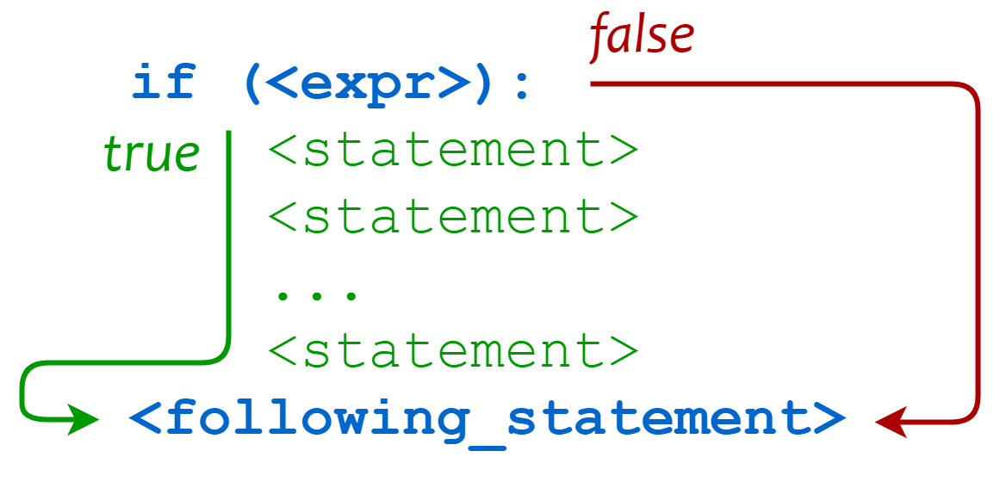

# 第三章  基本控制结构

作者：李昕

单位：中国石油大学（华东）

本章重点难点：掌握使用条件控制结构和循环控制结构设计累加、累乘、统计等算法的基本方法，理解嵌套的条件控制结构、嵌套的循环控制结构的流程控制过程，以及循环中断语句的作用；函数的作用和基本使用方法

## 1. 条件控制结构

- 选择结构

Python最具特色的就是使用缩进来表示代码块，不需要使用大括号 **{}** 。缩进的空格数是可变的，但是同一个代码块的语句必须包含相同的缩进空格数。通常采用4个空格表示缩进。

```python
if True:
    print ("True")
else:
    print ("False")
```

选择结构的基本流程如下图所示。*expr*表示判断条件，不需要额外添加小括号，但是必须以冒号结束。 相同缩进数的语句在一起组成一个语句块，表示受该条件影响的语句块。流程如下图所示：



下图中演示了while和if的具体执行流程，while在语法结构上与if完全相同，if只判断一次，但while会循环执行。


- 对于多重选择，python使用elif作为关键字

```python
age = int(input("请输入你家狗狗的年龄: "))
print("")
if age <= 0:
    print("你是在逗我吧!")
elif age == 1:
    print("相当于 14 岁的人。")
elif age == 2:
    print("相当于 22 岁的人。")
elif age > 2:
    human = 22 + (age -2)*5
    print("对应人类年龄: ", human)
```

- Python中采用*and, or, not*作为与或非的关键字。

> 3<a<9 这种复合条件的写法在C语言中是禁止的，但是在python中是允许的

## 2. 循环控制结构

- while循环

  通过以下两个动画演示，可以非常容易的了解while循环的执行过程。动画来源

  [https://blog.penjee.com]: https://blog.penjee.com/top-5-animated-gifs-explain-loops-python/	"penjee"

  

  

  在第二个动画中，也展现了list中从尾部移除元素pop函数和从尾部添加元素append()函数的使用方法。

  

- for...in循环
*for...in*循环主要用来遍历一个序列的所有元素
```python
languages = ["C", "C++", "Julia", "R", "Python"] 
for x in languages:	#iterate each element in the list 'languages'
    print(x)
for index,x in enumerate(languages):	#give an index for each element
    print(x)
```

对于一个字典，每个元素都有键和值，形成一个pair，调用字典的items函数完成遍历

```python
tinydict = {'name': 'upc','code':1, 'site': 'www.upc.edu.cn'}
for key in tinydict.keys():	        #iterate each key of the dict
    print(key,tinydict[key])
for key,val in tinydict.items():	#iterate each pair of the dict
    print(key,val)
```

类似的，*values()*函数用于展现一个字典中的所有值。

整数数列是常用的表达，常用于与for循环搭配使用。Python中用range([start,] stop[, step])进行创建整数序列， start: 计数从 start 开始。默认是从 0 开始； stop: 计数到 stop 结束，但不包括 stop； step：步长，默认为1。range默认产生一个对象，为了展现其生成的内容，下面代码中将结果强制转换为list对象。 

```python
print(list(range(10)))        # => [0, 1, 2, 3, 4, 5, 6, 7, 8, 9]
print(list(range(1, 11)))     # => [1, 2, 3, 4, 5, 6, 7, 8, 9, 10]
print(list(range(0, 30, 5)))  # => [0, 5, 10, 15, 20, 25]
print(list(range(0, 10, 3)))  # => [0, 3, 6, 9]
print(list(range(10, 0, -1))) # => [10, 9, 8, 7, 6, 5, 4, 3, 2, 1]
print(list(range(0)))		  # => []
print(list(range(1, 0)))	  # => []
x = 'intelligence'
for i in range(len(x)) :
    print(x[i])		#iterate each character in the string ’x'
```

- 循环使用else语句

  这是python中非常特殊的一条语句，循环可以与else进行结合， 在循环条件为 false 时执行 else 语句块： 

```python
count = 0
while count < 5:
   print(count, " is  less than 5")
   count = count + 1
else:
   print(count, " is not less than 5")
# => 0 is less than 5
# => 1 is less than 5
# => 2 is less than 5
# => 3 is less than 5
# => 4 is less than 5
# => 5 is not less than 5
```

下面这段代码演示了经典的素数判断算法：

```python
# Program to check if a number is prime or not
num = 407
# To take input from the user
#num = int(input("Enter a number: "))
# prime numbers are greater than 1
if num > 1:
   # check for factors
   for i in range(2,num):
       if (num % i) == 0:
           print(num,"is not a prime number")  # => 407 is not a prime number 
           print(i,"times",num//i,"is",num)    # => 11 times 37 is 407 
           break
   else:  #coresponding to ‘for’ loop. Here 'i' is equal to 'num'
       print(num,"is a prime number")
# if input number is less than or equal to 1, it is not prime
else:
   print(num,"is not a prime number")
```

注意这里的else与for匹配，而不是与if匹配。当*i*等于*num*时，循环正常结束，else语句块被执行。而循环从break处退出时，不会执行else语句块。

## 3. 函数

Python中的函数定义非常简单，应使用函数将单一功能进行抽取，不仅利于代码的重复使用，而且利于代码的组织。定义一个函数规则如下：

- 函数代码块以 **def** 关键词开头，后接函数标识符名称和圆括号 **()**。

- 任何传入参数和自变量必须放在圆括号中间，圆括号之间可以用于定义参数。

- 函数的第一行语句可以选择性地使用文档字符串—用于存放函数说明。

- 函数内容以冒号起始，并且缩进。

- **return [表达式]** 结束函数，选择性地返回一个值给调用方。不写return，或不带表达式的return相当于返回 None。

```python
def printme( str ):
   "This prints a passed string into this function"
   print(str)

printme('This is a simple function.')	# => This is a simple function.

# 计算面积函数
def area(width, height):
    return width * height

w,h = 4,5
print(" area =", area(w, h))	# => area = 20
```
由于隐式元组的机制，函数的返回值可以为多个对象。以下程序的返回值的输出效果可以看出元组的存在。
```python
import math
def circle(r):
    return 2*math.pi*r,math.pi*r*r

print(circle(3))  # => (18.84955592153876, 28.274333882308138)
```
- 可更改(mutable)与不可更改(immutable)对象

  在 python 中，string, tuple, 和 number 是不可更改的对象，而 list, dict 等则是可以修改的对象。

  - **不可变类型：** 变量赋值 **a=5** 后再赋值 **a=10**，这里实际是新生成一个 int 值对象 10，再让 a 指向它，而 5 被丢弃，不是改变a的值，相当于新生成了a。
  - **可变类型：** 变量赋值 **la=[1,2,3,4]** 后再赋值 **la[2]=5** 则是将 list la 的第三个元素值更改，本身la没有动，只是其内部的一部分值被修改了。

  python 函数的参数传递：

  - **不可变类型：** 类似 c++ 的值传递，如 整数、字符串、元组。如fun（a），传递的只是a的值，没有影响a对象本身。比如在 fun（a）内部修改 a 的值，只是修改另一个复制的对象，不会影响 a 本身。
  - **可变类型：** 类似 c++ 的引用传递，如 列表，字典。如 fun（la），则是将 la 真正的传过去，修改后fun外部的la也会受影响

  python 中一切都是对象，严格意义我们不能说值传递还是引用传递，我们应该说传不可变对象和传可变对象。
```python
#整形是不可变类型，形参的修改不会影响实参，相当于C语言里的传值方式
def changeint( a_int ):
    "This changes a passed list into this function"
    a_int=7;	#change the value on index 1
    print("Value inside the function: ", a_int)
    # => Value inside the function:  7

# Now you can call changeme function
a_int = 10;
changeint( a_int );
print("Value outside the function: ", a_int)
# => Value inside the function:  10
```

```python
#列表是可变类型，形参与实参共享存储空间，相当于C语言里的传地址方式
def changelst1( mylist ):
    "This changes a passed list into this function"
    mylist[1]=7;	#change the value on index 1
    mylist.append(40)	#append a new value
    print("Values inside the function: ", mylist)
    # => Values inside the function:  [10, 7, 30, 40]

# Now you can call changeme function
mylist = [10,20,30];
changelst1( mylist );
print("Values outside the function: ", mylist)
# => Values inside the function:  [10, 7, 30, 40]
```

```python
#对形参完全重新赋值，形参指向了新的列表，与实参脱离了关系
def changelst2( mylist ):
    "This changes a passed list into this function"
    mylist = [1,2,3,4]; # This would assig new reference in mylist
    print("Values inside the function: ", mylist)
    # => Values inside the function:  [1, 2, 3, 4]

# Now you can call changeme function
mylist = [10,20,30];
changelst2( mylist);
print("Values outside the function: ", mylist)	
# => Values outside the function:  [10, 20, 30]
```

## 4. 列表生成式

前文提到的素数判断可以写为以下函数。其中函数*all*的参数为一个序列，序列中所有元素的逻辑值都为*True*时，返回*True*，否则返回*False*。与*all()*函数类似的函数为*any()*函数，参数中序列的任意一个元素的逻辑值为*True*时，返回*True*，否则返回*False*。

```python
import math
def is_prime(n):
    if n<2: return False
    return all(n % i for i in range(3, int(math.sqrt(n)) + 1, 2))
```


### 练习题

1. 小明身高1.75，体重80.5kg。请根据BMI公式（体重除以身高的平方）帮小明计算他的BMI指数，并根据BMI指数：
   - 低于18.5：过轻
   
   - 18.5-25：正常
   
   - 25-28：过重
   
   - 28-32：肥胖
   
   - 高于32：严重肥胖
2. 如何将一个字典按照键排序输出，提示：用*sort()*函数。
3. 如何将一个字典按照值排序输出，提示：用*sort()*函数。

